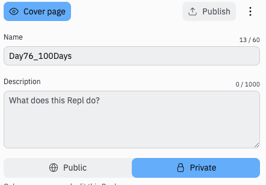
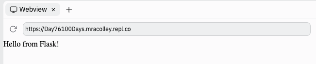
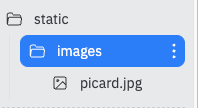

# Flask! 

The reason that we've spent the last few days learning HTML & CSS is so that we can combine them with Python by using **Flask**.

Flask lets us build our own web-server. This means that it runs all of the time, creating the pages for your entire website.

The reason Flask is different from just using HTML/CSS is that it can be used to build **dynamic** web apps that change depending on the user.

A web server works slightly differently. We make one web server, click `run`, and give the website address to anyone who wants to use the program. This means that *we can make our code private* if we want.
##
**Heads up here. Flask is a paid feature on Replit. You'll need to [purchase cycles or hacker plan](https://replit.com/pricing) if you want to use it.  It is super worthwhile if you want to keep your code private though.**

You can set your repl to private in the drop down menu from the top of the page.



## How Is Flask Code Different?

👉 Let's dig into the boilerplate code that you get when you start a Flask repl. Read the comments for explanations:


```python
from flask import Flask # Imports the flask library

app = Flask(__name__) # Starts the Flask application. The 'app' variable is very important. We'll be using that later.


@app.route('/') # Tells the code what to do if we've gone to our web address with just a / after the URL
def index(): # Tells the code which webpage to show. This subroutine will display the 'Hello from Flask' page
    return 'Hello from Flask!'


app.run(host='0.0.0.0', port=81) # This line should ALWAYS come last. It's the line that turns on the Flask server.

```

👉 When we run this starter code, here's what we get:



You can see the page URL at the top of the screenshot. You can visit that same URL from your phone/tablet etc. and you'll see the same page.

Whenever you make changes now, refreshing the page won't update it. You need to stop and run the program to view any changes.

## More Pages

👉 Next, I'm going to add a 'home' page to the Flask code.

```python
from flask import Flask

app = Flask(__name__)


@app.route('/')
def index():
    return 'Hello from Flask!'

@app.route('/home') # Creates the path to the home page
def home(): # Subroutine to create the home page
  # Three quotes followed by the html for the baldies site. Three more quotes to close. All the HTML is assigned to the 'page' variable
  page = """<html>
    
  <head>
    <title>David's World Of Baldies</title>
  </head>


  <body>
  <h1>Dave's World of Baldies</h1> 
  <h2>Welcome to our website!</h2>

  <p>We all know that throughout history some of the greatest have been Baldies, let's see the epicness of their heads bereft of hair.</p>

  <h2>Gallery of Baldies</h2>
  <p>Here are some of the legends of the bald world.</p>

   
  <p><a href = "https://memory-alpha.fandom.com/wiki/Star_Trek:_Picard">Captain Jean Luc Picard: Baldest Star Trek captain, and legend.</a></p>

  <ul>
    <li>Beautiful bald man</li>
    <li>Calm and cool under pressure</li>
    <li>All the Picard memes</li>
  </ul>

  <p><a href = "page2.html">Go to page 2</a></p>
  
</body>
  
</html>
  
  """
  
  return page # returns the contents of the page variable


app.run(host='0.0.0.0', port=81)

```

Now if we visit the page *URL/home* in our browser, we will be whisked to the home page to view the design masterpiece that we've created.

You may notice here that the images are missing, so that's what we're going to do next.

## Images With Flask

To get images with Flask, we have to:

1. Create a folder in the file pane. By default, it's called 'static'.
2. Upload any files you want your webpages to access - images, audio, video etc. (You can create subfolder structures in the static folder to help you stay organized).
3. Add a new property to the `app = Flask` line of code:
```python
app = Flask(__name__, static_url_path="/static")
```
I've added an 'images' subfolder and uploaded my Picard image to there. 



Now I've updated the `<a href>` tag to reference the 'static' folder:

```html
 
```


### Try it out!